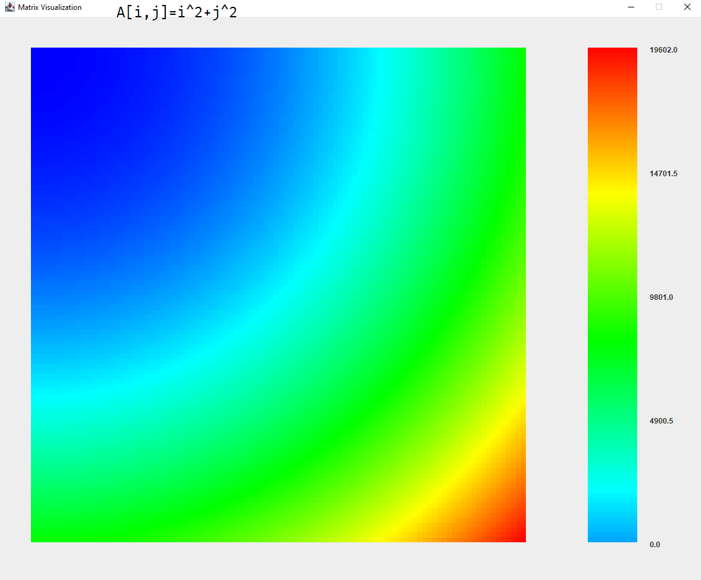

Visualization of heterogeneity in a matrix by mapping the values in the matrix to RGB values:  
We aim to contruct heat-maps of matrices in java, similar to the imagesc function in octave

To get the heat map of a matrix _arr_ first initialize a new *Display* object with _arr_  
**Display dis = new Display(_arr_);**  
Then call the _show_ method to create the heat-map  
**dis.show();**  
You can also show a color-scale for reference:  
**dis.colorBar(100)** // divided the color-bar into hundred divisions. For a more accurate scale, use a higher value, although 100 is the recommended value
